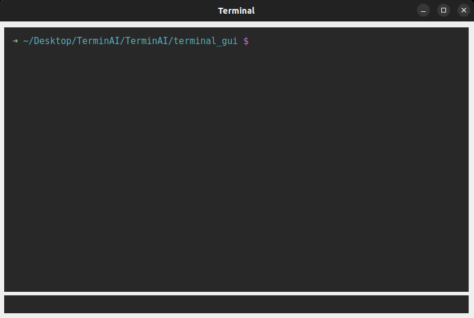

# Terminal GUI

This is the GUI made using pyQT5. This establishes comms with the [Backend endpoint](./Backend_endpoint/commsBack.py). 

---

This allows users to enter text, in whichever way the user wants, and get things done! In addition to that, it looks good.

- [x] Send prompt to the [backend endpoint](../Backend_endpoint/commsBack.py)
- [x] Recieve prompt from backend endpoint
---