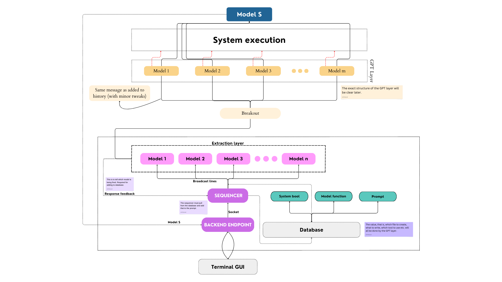

# TerminAI

  
  

**A terminal with AI capabilities.** Forget commands, just tell it what it do! 

> [!IMPORTANT]
> A step towards **AIOS**.

Check out the terminal [here](./terminal_gui/README.md)!

## The structure

For a better understanding of the structure refer the [workflow](./idea/README.md)

This is the old architecture.

---

> [!IMPORTANT]
> Complete means, in a ready to work **right now** condition.

Pending work:

- [x] Write the workflows properly. Don't leave anything ambiguous.
- [x] Complete [sequencer](./Sequencer). The pending work will be listed there.
- [ ] Figure out the small part of sending GPT layer data in history is required or not.
- [ ] Complete [endpoint](./Backend_endpoint). The pending work will be listed there.  
- [ ] Complete [breakoutGPT](./BreakoutGPT). The pending work will be listed there.
- [ ] Write all extraction models. This will take some time.
- [ ] Complete GPT layer.

one more thing,

- [ ] Add links to [workflow](./idea/README.md) and make it readable.

---

## Installing

To install the necessary dependencies, use the following command

    pip install -r requirements.txt

Since, I don't have a huge database, you will need to set up your own in [supabase](https://supabase.com/). This better because now its fully personalised for you.

### Steps to setup the database

1. Head over to [supabase](https://supabase.com/). Create a new project.
2. You will receive a `URL` and a `key`. Place those in [API Keys file](./Sequencer/api_keys.py) in the approriate spot (it has been demarcated for you).
3. Create a table with the name `History`.

And you're good to proceed.

### Adding API keys

To run the models you will need an API key. 

1. Here over to [google gemini](https://ai.google.dev/gemini-api/docs/api-key) and get your API key.
2. Place your API key in the [API keys file](./extraction_models/api_keys.py). The exact spot has been demarcated for you.

And you're good to go!

For modularity's sake, you may wish to add these keys in [the home](./api_keys.py) API file as well. :smile:

---

## PART A

Check out [part A](./PartA_backend). This is essentially the main communcations part. The exact sequence is present in that respective directory

For an understanding of the communications in Part A, refer the [workflow](./PartA_backend/workflow.md)

---

BRUH!!!

1. You don't need a broadcaster in the sequencer. Why? Because the only goal of the extraction layer is to figure out if there is a system level change required or not.
2. We will still add history and all to the message, just not broadcast it to multiple models, rather keep only 1 model there.
3. This 1 model's entire job is to identify if there is a system level change needed or not.
4. After it has identified, we will give feedback to the sequencer in the same manner.

This time, in history we will add,

- prompt
- sysbool
- work_summary (a short snippet of what work was performed)

We will append this to the history, in case the user enters multiline prompts that all require system level changes.

5. After it has identified, it will by itself, send it to breakout, which will send it to the relevant ports for system and non-system.
6. The breakout will broadcast it to the GPT layer. These are less general models like

- file operations (opening, writing file etc)
- operating system operations (changing brightness, killing processes, changing permissions)
- application level operations (starting a browser, searching for a specific thing, closing a certain software, using a specific software)
- network level operations (switching wifi bluetooth on and off, checking connected devices via USB)
- installing operations (new software, pip installs, sudo apt-gets)

7. These will result in some output. Then we'll have a bunch of bash commands under that. We'll give another LLM these commands, tell it to figure out the right one to do what we want to do, and use those?

Something like that. Will sort the last one out later.