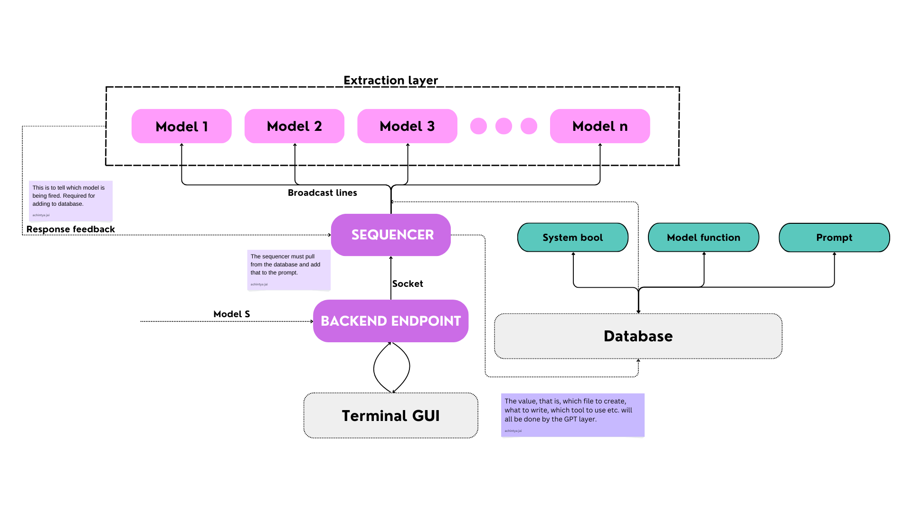

# Part A

This is the first half of the process. The following image will clarify exactly what is happening in this half. 

---

> [!IMPORTANT] 
> To start

> Run the backend endpoint first

		python3 ./Backend_endpoint/commsBack.py

> Run the terminal 

		python3 ./terminal_gui/termEMU.py

> Run the sequencer

		python3 ./Sequencer/sequencer.py

---

## Brief explanation

The code so far is able to broadcast whatever the user enters on the terminal, to all the running models.

Here is a brief explanation of how this part works.

---

## Potential issues

- [ ] Check in the `main` function, if the self.message_queue.get(timeout=5) is waiting for completion rather than broadcasting the data it gets right away.

> fix?

--- 