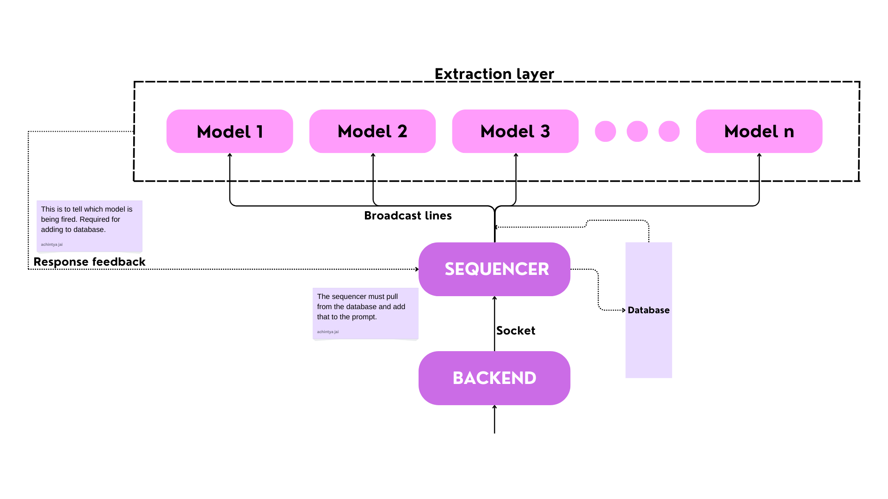

# **Sequencer**

The sequencer is the core component responsible for establishing communication between the user and the extraction layer.

---

---

## **Functionality**

The sequencer performs the following tasks:

- [x] **Broadcasting**: Sends the user's message to all connected clients.  
- [x] **Receiving Feedback**: Collects responses from models, which include:
  - `system_boolean` (indicates if a model fired up)  
  - `model_function` (the function performed by the model)  
  - `work_summary` (a summary of the model's operation)  
- [x] **Storing Feedback**: Connects to Supabase and pushes the following data into the database:
  - `system_boolean`  
  - `ex_model_function`  
  - `user_prompt`  
  - `ex_work_summary`  
- [x] **History Integration**:  
  - Before broadcasting, pulls relevant data from the database and appends it to the user's message as `history`.
- [x] **Multi-Response Handling**:  
  - Manages multiple responses from the extraction layer and ensures all are added to the database.

---

> [!NOTE]
> If you're adding your own models in the extraction layer, then make sure to increment the [sequencer](./sequencer.py) code to include broadcasting to that port. For information on adding a new model refer the [extraction layer](../extraction_models) 