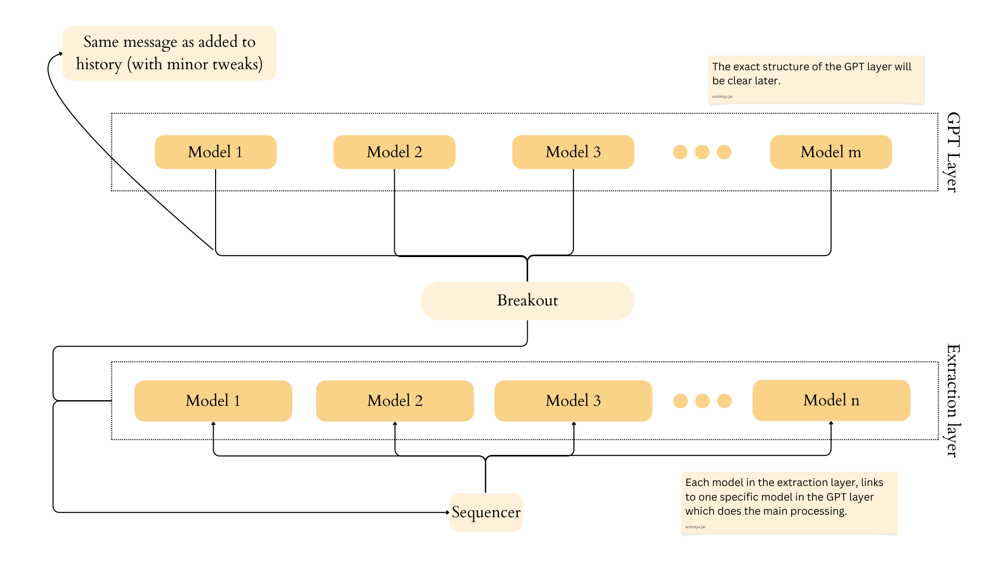

# Workflows

This is how the basic structure of the `extraction layer`

---

Have each file run two models. 
1. Figures out if the prompt + history, requires this model to run. Simply outputs yes or no.
2. If the above model outputs `yes`, then the actual feature extraction model runs, and generates a `json`.

## Json

Their json should basically contain

1. The model name --> to tell what the model was doing
2. The relevant values.

## Functionality

- [x] Each model receives user's prompt at roughly the same time.
- [x] Models are able to extract the relevant features.
- [x] Have the two models working.
- [x] The prompts are present in the `address.py` file, so creating new models (or clients) is a simple matter of copy and pasting the client codes.
- [x] Models are able to judge based on history as well. 
- [x] Models are sending feedback to the sequencer, which includes their model name.

> [!NOTE]
> We might get more than one responses from the extraction layer. 

---

- [ ] Handle more than one response from extraction layer.

How? 

- [ ] More than one responses means, all of them must be added to the database by the sequencer.
- [x] If it is two or more other models, that means they all send their jsons to the breakout.

For these we will have to modify the breakout code. Will work on that tomorrow.

> [!TIP]
> Having a breakout is always better and costs nothing. Don't add too much logic in one part. Diversify.

- [x] Create comms with breakout.

---

For sequencer logic, head over [here](../Sequencer/idea/Workflow_sequencer.md)

For model logic, head over [here](./idea/Workflow_clients.md)

---