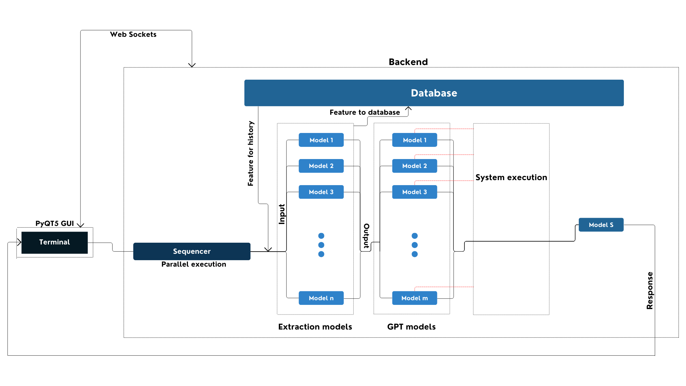

# TerminAI

  
  

**A terminal with AI capabilities.** Forget commands, just tell it what it do!

Check out the terminal [here](./terminal_gui/README.md)!

---

For a better understanding of the structure refer the [workflow](./idea/README.md)

This is the basic architecture. The more detailed ones will be present in the respective directories.

---

> [!IMPORTANT]
> Complete means, in a ready to work **right now** condition.

Pending work:

- [x] Write the workflows properly. Don't leave anything ambiguous.
- [ ] Complete [sequencer](./Sequencer). The pending work will be listed there.
- [ ] Complete [breakoutGPT](./BreakoutGPT). The pending work will be listed there.
- [ ] Write all extraction models. This will take some time.
- [ ] Complete GPT layer.

one more thing,

- [ ] Add links to [workflow](./idea/README.md) and make it readable.

---