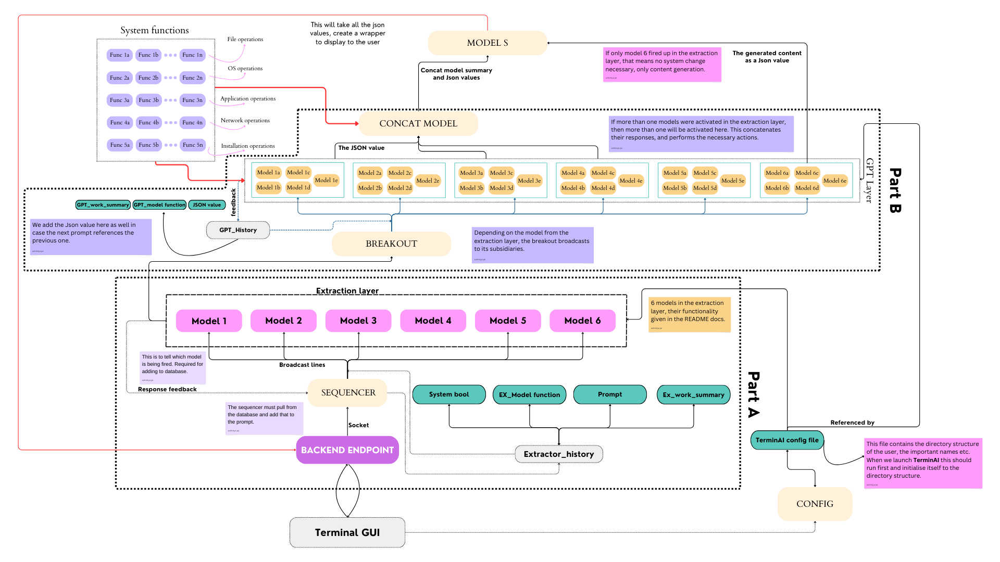

# TerminAI

  
  

**A terminal with AI capabilities.** Forget commands, just tell it what it do! 

Check out the terminal [here](./terminal_gui/README.md)!

## Setup

We need to define a setup that will read the user's current directory structure, username and all that stuff to generate specific commands.

> [!IMPORTANT]
> I was thinking something similar to `ncdu`? It should also know what softwares are currently installed only then can it tell if we need to install this!!

## Things to do RN!

- [ ] Create setup
We can probably use pyautogui for some 

once `part A` is robust, we'll move to GPT layer.

## The structure

For a better understanding of the structure refer the [workflow](./idea/README.md)

This is the revised version.

---

> [!IMPORTANT]
> Complete means, in a ready to work **right now** condition.

Pending work:

- [x] Write the workflows properly. Don't leave anything ambiguous.
- [x] Complete [endpoint](./Backend_endpoint). 
- [x] Complete [sequencer](./Sequencer).
- [x] Write all 6 [extraction models](./extraction_models). 
- [ ] Complete [breakoutGPT](./BreakoutGPT). The pending work will be listed there.
- [ ] Create system functions.
- [ ] Complete GPT layer.
- [ ] Create concat model.
- [ ] Create Model S.

one more thing,

- [ ] Add links to [workflow](./idea/README.md) and make it readable.

---

## Installing

To install the necessary dependencies, use the following command

    pip install -r requirements.txt

Since, I don't have a huge database, you will need to set up your own in [supabase](https://supabase.com/). This might be better because now its fully personalised for you.

> [!NOTE]
> Have added API keys for supabase and gemini over the environment 

### Steps to setup the database

1. Head over to [supabase](https://supabase.com/). Create a new project.
2. You will receive a `URL` and a `key`. Create a `.env` file in the root directory when you clone this repo, and save these as `SUPABASE_URL` and `SUPABASE_KEY` respectively.
3. Create a table with the name `History_v2`.

And you're good to proceed.

### Adding API keys

To run the models you will need an API key. 

1. Here over to [google gemini](https://ai.google.dev/gemini-api/docs/api-key) and get your API key.
2. In the `.env` file, save the key as `API_KEY=<your_key>`

And you're good to go! :smile:

---