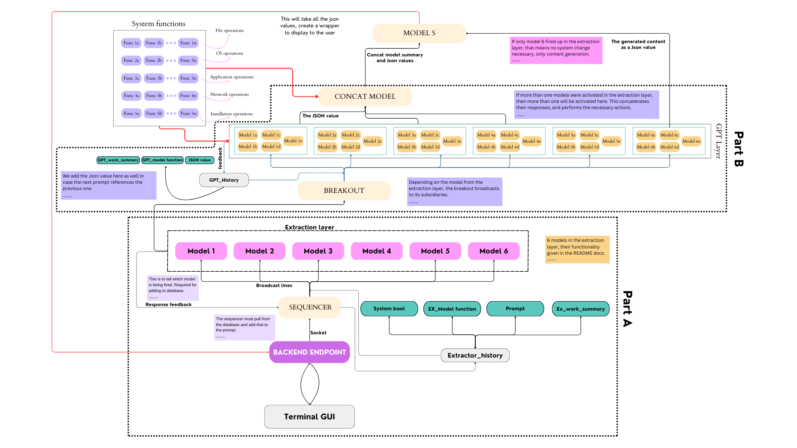

# TerminAI

  
  

**A terminal with AI capabilities.** Forget commands, just tell it what it do! 

Check out the terminal [here](./terminal_gui/README.md)!

## Stuff to test out

- [ ] Test out if the models output as they should.
- [ ] Test the parsing logic.
- [ ] Test the comms again.  
- [ ] Test part A.

## Brief explantion of the Idea

1. The user is expected to enter something like "write a 500 word essay on Abraham Lincon in a file in my desktop".

2. The user's prompt is sent first to the [backend_endpoint](./Backend_endpoit). This is a breakout, where it receives message to send to the user, and forwards the user's prompt for further processing.

3. Now comes the sequencer. This will broadcast the message to all the models in the extraction layer. These are many in number and they are extracting what exactly the user wants, in broad terms. 

I am thinking 6 extraction models,

    file operations (opening, writing to a file, creating a directory)
    operating system operations (changing brightness, killing processes, changing permissions)
    application level operations (starting a browser, searching for a specific thing, closing a certain software, using a specific software)
    network level operations (switching wifi bluetooth on and off, checking connected devices via USB)
    installing operations (new software, pip installs, sudo apt-gets)
    content generation operations (any content that needs to be printed on the terminal, printed on terminal being important here. For example, greetings.)

These are broad and cover most of the use cases.

4. In this case, the expected output is from 1 model, `file operations` detector. This will give sysbool as `True`. It will give a summary as well, and the function name gives the type of detection it was performing.

5. This will be sent to the sequencer as the feedback to add to the database. 

6. This will also be sent to the breakout GPT. This will figure out which GPT model to send the data to based on where it is coming from. `File operations` will have its own smaller GPT models, and this will figure out where to send what. 

7. The smaller GPT models will basically try to generate a json type object of the necessary parameters, to fulfill the request and see which parameters are missing. The missing ones, they'll add on their own. 

> [!IMPORTANT]
> The breakout will broadcast this message to a certain group of ports, specific for file operations, like read, write, delete, touch, change permissions etc. There are many. The relevant ones respond with a 'yes' and therein lies bash scripts or `os commands`, whichever is more convinent that they can run based on what they do.

In this case, the write will fire up, which will create a json object containing where to write and what to write. Then the functions inside, will actually do that.

The model will then send this json object to model S, it will have a comprehensive history of what all has happened till now, and Model S will create a wrapper around it, beautify it and present it to the user.

8. If 2 extraction models fire up (which won't be very uncommon) then both of them will send for the breakout and the breakout will figure out where to forward each message based on where it came from (that is, what the original function's function was...)

Then, each will create a json object, and send that to the Model S.

What if they are dependent on each other? What if we have to write to a value that the other finds? 

For this we have a `concatenation model`. All json passes through the concatenation model, which looks at them all, judges if they are to be concatenated and does that (note that, the json contains the "value" that the model found, if it found anything at all). It has code to concatenate them. It will usually be do something, then based on that do something else. If there are more than 2, then we just tell the user to fuck off (for now...).

or we don't have to hardcode at all, we'll have a python file that has functions extensively written to perform different tasks. We will import this file and take the relevant functions.

---

Now it seems clearer. Let's see tomorrow with a fresher mind.

## The structure

For a better understanding of the structure refer the [workflow](./idea/README.md)

This is the latest version.

This is version 1.

> [!NOTE]
> There were issues with Version 1, which is why we had to switch to v3. (let's not talk about version 2)

So, this is the basically it. Lot's of revisions were made. Will have to update all readmes.

- [ ] Update all readmes with new work.

---

> [!IMPORTANT]
> Complete means, in a ready to work **right now** condition.

Pending work:

- [x] Write the workflows properly. Don't leave anything ambiguous.
- [ ] Complete [endpoint](./Backend_endpoint). The pending work will be listed there. 
- [ ] Complete [sequencer](./Sequencer). The pending work will be listed there.
- [ ] Write all 6 [extraction models](./extraction_models). 
- [ ] Complete [breakoutGPT](./BreakoutGPT). The pending work will be listed there.
- [ ] Create system functions.
- [ ] Complete GPT layer.
- [ ] Create concat model.
- [ ] Create Model S.

one more thing,

- [ ] Add links to [workflow](./idea/README.md) and make it readable.

---

## Installing

To install the necessary dependencies, use the following command

    pip install -r requirements.txt

Since, I don't have a huge database, you will need to set up your own in [supabase](https://supabase.com/). This better because now its fully personalised for you.

### Steps to setup the database

1. Head over to [supabase](https://supabase.com/). Create a new project.
2. You will receive a `URL` and a `key`. Place those in [API Keys file](./Sequencer/api_keys.py) in the approriate spot (it has been demarcated for you).
3. Create a table with the name `History`.

And you're good to proceed.

### Adding API keys

To run the models you will need an API key. 

1. Here over to [google gemini](https://ai.google.dev/gemini-api/docs/api-key) and get your API key.
2. Place your API key in the [API keys file](./extraction_models/api_keys.py). The exact spot has been demarcated for you.

And you're good to go!

For modularity's sake, you may wish to add these keys in [the home](./api_keys.py) API file as well. :smile:

---

# Better

Instead of having different functions, 

1. The models in the GPT layer are recieving the json data. The json data contains all the relevant parameters that the user would need to use in order to achieve the task.

2. If the task is acheivable by the terminal, then the commands present in the `/bin` directory will suffice. This means...

We just pass the json data to the model, ask them to use the available functions in `/bin` and give code. Then execute that! 