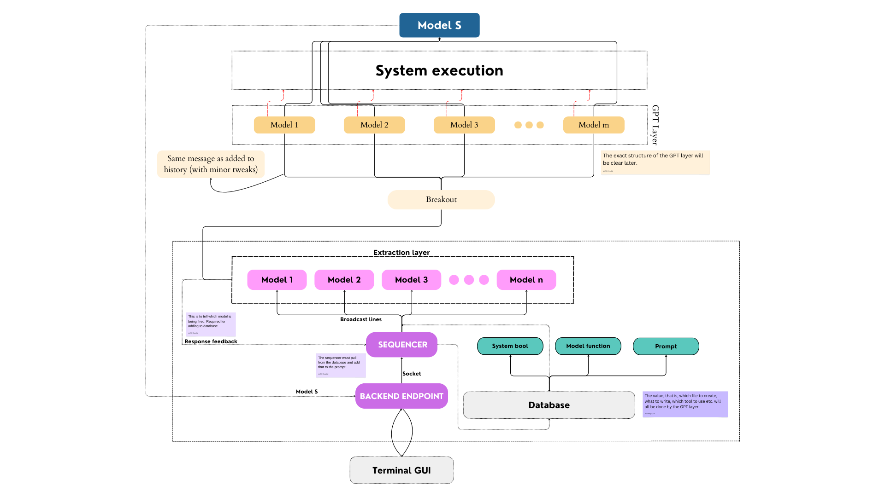

# TerminAI

  
  

**A terminal with AI capabilities.** Forget commands, just tell it what it do!

---

For a better understanding of the structure refer the [workflow](./idea/README.md)

This is the basic architecture. The more detailed ones will be present in the respective directories.

---

Pending work:

- [x] Write the workflow properly. Don't leave anything ambiguous.
- [x] Write sockets between GUI and Backend endpoint (`Be`)
- [ ] Write sockets between `Be` and `sequencer`.
- [ ] Complete sequencer.
- [ ] Update README.md
- [ ] Make the repository navigable.

---
