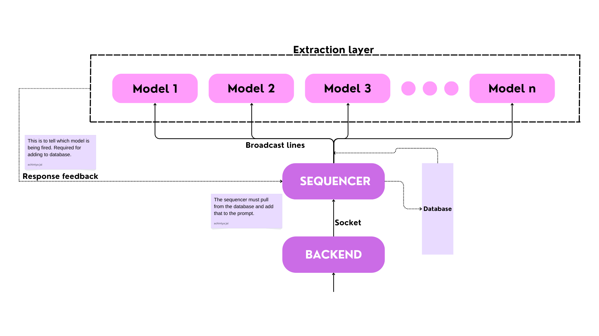

# Sequencer

Functionality

- [x] Broadcast user's message to all clients.
- [x] Receive feedback, that is, which model fired up and what the response was.

The response will either be a binary or a tertiary, no more that than.

- [ ] Connect to supabase and push the feedback.
- [ ] Before broadcasting, pull from database and add that to the user's message, explicitly mentioning it as `history`.

---

The sequencer is the main part of the problem, responsible for `establishing communications` between the client and all the models.

