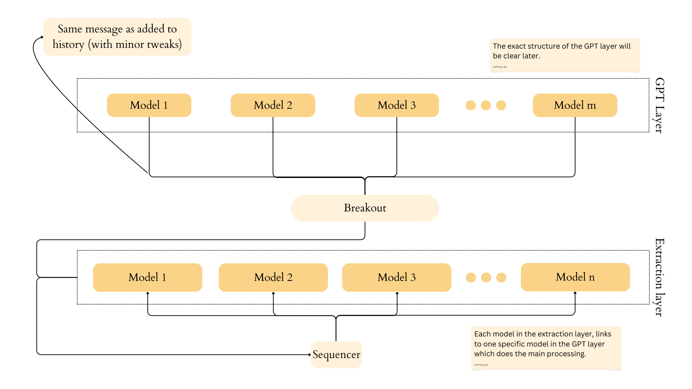

# Workflows

This is how the basic structure of the `extraction layer`

---

## Functionality

- [x] Each model receives user's prompt at roughly the same time.
- [x] Models are able to extract the relevant features.
- [x] The prompts are present in the `address.py` file, so creating new models (or clients) is a simple matter of copy and pasting the client codes.
- [x] Models are able to judge based on history as well. 

For example, if the user had mentioned that he is a man, and now he says he wants tea, then two models fire up, one that detects if the user is a man and the other that detects if he wants tea.

> [!NOTE]
> We want only one response. In actuality, what should've happened in the above case is, the 'detect if man' model should've fired up, if only it were relevant to the current prompt. Might be an easy, might be not.

Now this is the **tricky part** because we can either have another breakout responsible for figuring out which message goes to which GPT model, or have the code in the clients themselves.

> [!TIP]
> Having a breakout is always better and costs nothing. Don't add too much logic in one part. Diversify.

- [x] Create comms with breakout.

The models are able to send the system boolean, the user's prompt, and their own name to the breakout. **The breakout is then expected to use the name, figure out its functionality, then use the system bool and prompt to figure out where to send the message in the GPT layer**.

---

For sequencer logic, head over [here](../Sequencer/idea/Workflow_sequencer.md)

For model logic, head over [here](./idea/Workflow_clients.md)