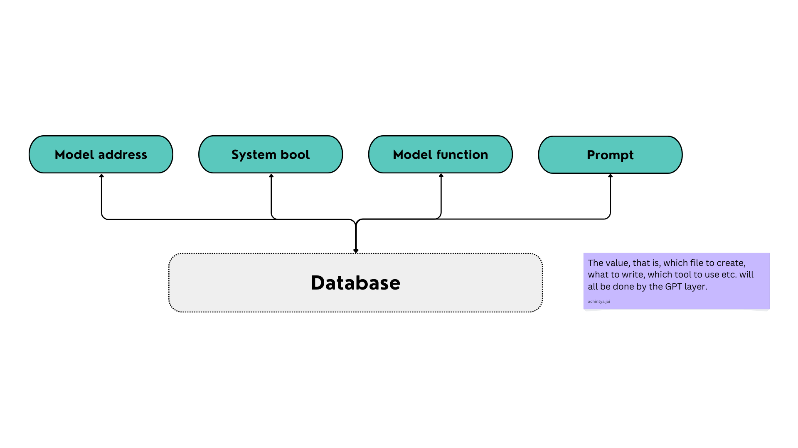

# History implementation

This is the basic flow-diagram of what all goes inside the history.

This is all done by the sequencer itself. The models by themselves are not going to add or pull anything from the database.

---

## Model's reply to sequencer

This is what model replies to the sequencer, and what the sequencer receives

1. Address
2. Timestamp
3. Port_number

From these, we care about `Address` and the `Port_number`. We'll use the port number to figure out the model function using the `function_dict` in the [address](./address.py) code. 

Note that, if the model is replying, it will only do so, when its specific task is being called. That is, it will reply only when ignited. This is how the models have been coded to behave. 